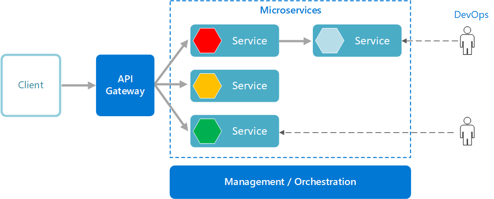
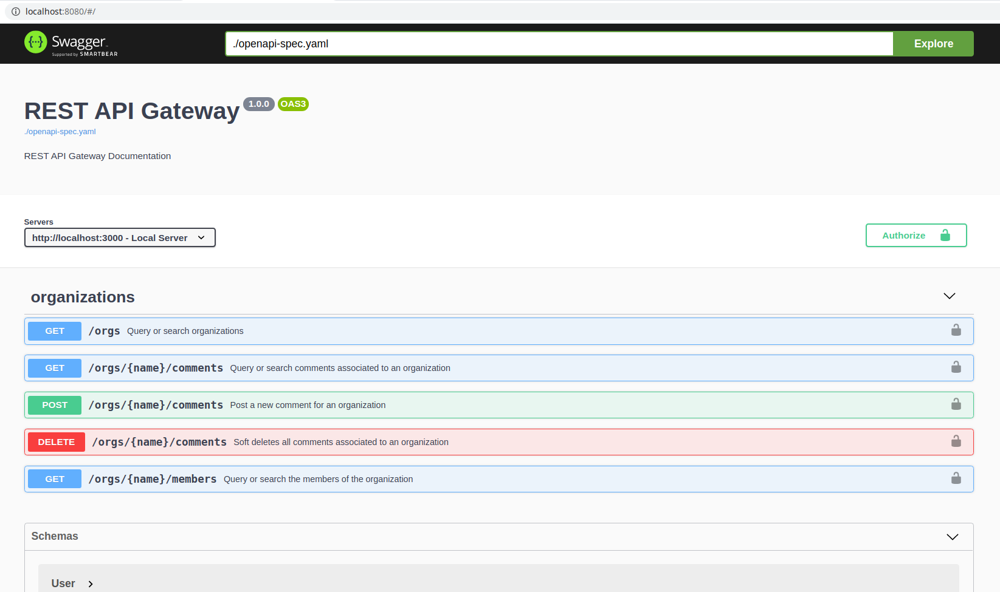

# NestJS REST API Gateway + gRPC microservices + TypeORM

이 프로젝트는 [monorepo](https://gomonorepo.org/) API 게이트웨이를 포함하며 [gRPC](https://grpc.io/) b백엔드 마이크로서비스는 모두 NestJS 프레임워크와 TypeScript를 사용하여 작성된다. 이 프로젝트는 주로 학습/실험 목적으로만 사용된다.


## Architecture Overview

나머지 REST API는 노출되는 다양한 마이크로 서비스에 대한 게이트웨이/프록시 역할을한다. REST API의 컨트롤러는 백엔드에서 gRPC 서버/마이크로 서비스를 호출합니다. 그런 다음 GRPC 마이크로 서비스는 데이터베이스 또는 요청을 제공하는 데 필요한 다른 서비스에 연결하는 요청을 처리한다.

### Diagram

아키텍처 다이어그램은 아래에 나와 있습니다.



### Design Patterns

이 아키텍처는 다음과 같은 마이크로서비스 디자인 패턴을 구현합니다.

1. [Microservice Architecture](https://microservices.io/patterns/microservices.html)
2. [Subdomain Decomposition](https://microservices.io/patterns/decomposition/decompose-by-subdomain.html)
3. [Externalized Configuration](https://microservices.io/patterns/externalized-configuration.html)
4. [Remote Procedure Invocation](https://microservices.io/patterns/communication-style/rpi.html)
5. [API Gateway](https://microservices.io/patterns/apigateway.html)
6. [Database per Service](https://microservices.io/patterns/data/database-per-service.html)

## Layers

###API Layer

[NestJS + Express](https://nestjs.com/) 는 아키텍처를 위한 API 계층 역할을 한다. 클라이언트의 요청을 수신하고 이를 이행하기 위해 적절한 백엔드 마이크로 서비스를 호출하는 작업을 담당합니다.

###Microservice Layer

[gRPC](https://grpc.io/) 는 마이크로 서비스를 수행하기 위한 프레임워크로 선택되었습니다. [프로토콜 버퍼](https://developers.google.com/protocol-buffers/) 는 클라이언트(REST API)와 서버(gRPC 마이크로서비스) 간의 데이터 교환 형식으로 사용되었습니다. NestJS는 여전히 gRPC Microservices를 만드는 데 사용되는 프레임워크입니다.

###Persistence Layer

PostgreSQL은 데이터베이스로 사용되며 Sequelize는 ORM(Object-Relational Mapper)으로 사용됩니다.

##Deployment

배포는 컨테이너를 염두에 두고 수행됩니다. 모든 컴퓨터에서 전체 작업을 실행할 수 있도록 각 프로젝트의 Docker 파일과 Docker Compose 파일이 제공됩니다. 프로덕션의 경우 이러한 종류의 마이크로서비스 아키텍처를 프로덕션에 배포하려면 항상 [Kubernetes](https://kubernetes.io/) 를 사용하는 것이 좋습니다. [Istio](https://istio.io/) 는 서비스 검색, 분산 추적 및 기타 관찰성 요구 사항을 처리합니다.

## Project Structure

```
.
├── _proto
├── api-gateway
│   └── src
│       ├── _proto
│       ├── comments
│       ├── commons
│       ├── health-check
│       ├── organizations
│       ├── users
│       └── utils
├── docs
├── microservices
│   ├── comments-svc
│   │   └── src
│   │       ├── _proto
│   │       ├── comments
│   │       ├── commons
│   │       └── database
│   ├── organizations-svc
│   │   └── src
│   │       ├── _proto
│   │       ├── commons
│   │       ├── database
│   │       └── organizations
│   └── users-svc
│       └── src
│           ├── _proto
│           ├── commons
│           ├── database
│           └── users
└── scripts
```

### Project Organization

1. `_proto` - 이 디렉토리는 모든 gRPC 서비스 정의/프로토콜 버퍼로 구성됩니다.

2. `api-gateway` - 이 디렉토리는 API Gateway 프로젝트로 구성됩니다. API Gateway와 관련 된 모든 코드가 여기에 있습니다.

3. `docs` - 이 디렉토리는 documentation 와 관련 된 모든 파일로 구성됩니다. REST API 및 gRPC 서비스 정의/프로토콜 버퍼 설명서의 OpenAPI 사양은 여기에서 확인할 수 있습니다.

4. `microservices` - 이 디렉토리는 모든 마이크로서비스 프로젝트로 구성됩니다.

5. `microservices/comments-svc` - 이 디렉토리는 Comments Microservice 프로젝트와 관련된 모든 파일/코드로 구성됩니다.

6. `microservices/organizations-svc` - 이 디렉토리는 Organizations Microservice 프로젝트와 관련된 모든 파일/코드로 구성됩니다.

7. `microservices/users-svc` - 이 디렉토리는 Users Microservice 프로젝트와 관련된 모든 파일/코드로 구성됩니다.

8. `scripts` - 이 디렉토리는 전체 프로젝트의 빌드 및 실행을 자동화하는 쉘 스크립트로 구성됩니다.

## How to Run

1. 시스템 요구 사항 - Linux/Mac이어야 합니다.
- [Node.js](https://nodejs.org/en/) - v12 권장
- [도커](https://docs.docker.com/install/) - 최신 정보
- [Docker Compose](https://docs.docker.com/compose/install/) - 최신 정보

2. 터미널에서 프로젝트의 root 폴더('cd /project/root/folder')에 들어가서 `npm start` 를 실행합니다. 시작 스크립트는 모든 프로젝트에 대해 모든 npm 종속성을 설치한 후 코드를 컴파일하고 아티팩트(Docker images)를 빌드한 후 'docker-compose'를 통해 실행합니다.

3. 시작 스크립트가 완료되면 API 게이트웨이가 [http://localhost:3000](http://localhost:3000) 에서 수신합니다.

4. API를 테스트하려면 [http://localhost:8080](http://localhost:8080) 에서 실행되는 Swagger UI로 이동합니다.



## Roadmap

### General

- [ ] Use RxJS Observables instead of Promises
- [ ] Add Integration Tests
- [ ] Add CI/CD Pipeline
- [ ] Add Kubernetes Manifests
- [x] Pre-populate DBs
- [ ] Distributed Tracing(분산 추적)

### API Gateway

- [ ] Add authentication
- [ ] Add authorization
- [ ] event sourcing 추가
- [ ] 요청/입력 데이터 유효성 확인 추가
- [ ] error handling 개선
  
### Microservices

- [ ] Add health checks
- [ ] Add caching
- [ ] error handling 개선
